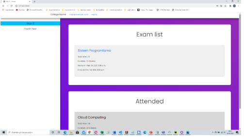

# Online Examination System

This repository created for online examination system. It was written by Django Framework.

## How does it work?

Basically this system provides to take the exams online. There is an admin panel and only instructors can login to the panel. 
Instructors can upload questions/answers and set the date/time of the exam, via this panel. In addition, the instructor can assign students to exams.
The most crucial part of the system is that students can't attend the exam before the predetermined exam time.
When the exact exam time comes, students can see the questions and must answer the questions within the determined exam time.

### Student Login Screen

### Admin Panel

### Attended exams view

### Questions

